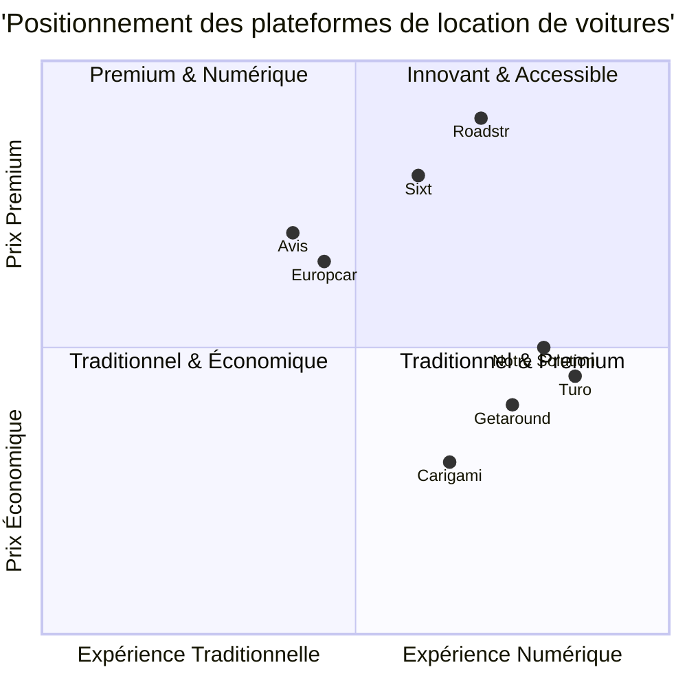

# Document d'Exigences de Produit (PRD) - Site de Location de Voitures

## 1. Informations du Projet

- **Langage de programmation** : React, JavaScript, Tailwind CSS
- **Nom du Projet** : auto_location_web
- **Exigences Originales** : Créer un site web de location de voitures incluant les fonctionnalités de recherche et réservation de véhicules, gestion des comptes utilisateurs, et système de paiement.

## 2. Définition du Produit

### 2.1 Objectifs du Produit

1. **Simplifier l'expérience de réservation** - Offrir une plateforme intuitive permettant aux utilisateurs de trouver et réserver rapidement le véhicule idéal selon leurs besoins.
2. **Maximiser l'efficacité opérationnelle** - Fournir des outils de gestion de flotte et d'administration qui optimisent l'utilisation des véhicules et réduisent les efforts manuels.
3. **Générer une croissance commerciale durable** - Intégrer des fonctionnalités d'analyse et de fidélisation pour augmenter la valeur client à long terme.

### 2.2 User Stories

1. **En tant que voyageur**, je souhaite filtrer les voitures disponibles par date, lieu et type de véhicule afin de trouver rapidement un véhicule adapté à mes besoins.
2. **En tant qu'utilisateur régulier**, je veux créer un compte qui sauvegarde mes préférences et informations de paiement pour faciliter mes réservations futures.
3. **En tant que client pressé**, je souhaite pouvoir réserver et payer en quelques clics avec une confirmation immédiate pour gagner du temps.
4. **En tant que voyageur indécis**, je veux pouvoir comparer facilement les différentes options de véhicules et leurs caractéristiques pour faire le meilleur choix.
5. **En tant qu'administrateur**, je souhaite gérer facilement la disponibilité des véhicules et les réservations via un tableau de bord intuitif pour optimiser l'utilisation de la flotte.

### 2.3 Analyse Concurrentielle

Voici une analyse des principales plateformes de location de voitures :

#### Sites Traditionnels

1. **Avis/Hertz/Europcar**
   - **Avantages** : Large réseau d'agences, fiabilité des services, véhicules bien entretenus, service client professionnel
   - **Inconvénients** : Coûts cachés, prix élevés, processus de location parfois complexe, flexibilité limitée

2. **Sixt**
   - **Avantages** : Flotte premium, expérience numérique avancée, programme de fidélité attractif
   - **Inconvénients** : Positionnement tarifaire élevé, couverture géographique plus limitée

3. **Carigami (comparateur)**
   - **Avantages** : Comparaison facile entre loueurs, service client français, transparence des prix
   - **Inconvénients** : N'est pas un loueur direct, dépendance aux partenaires pour la qualité de service

#### Plateformes Entre Particuliers

4. **Getaround (ex-Drivy)**
   - **Avantages** : Prix compétitifs, proximité des véhicules, système Connect pour location dématérialisée
   - **Inconvénients** : Qualité variable des véhicules, support client limité en cas de problème

5. **Turo (ex-Ouicar)**
   - **Avantages** : Large choix international, technologie sans contact, options de véhicules uniques
   - **Inconvénients** : Risque de litiges entre utilisateurs, disponibilité inégale selon les zones

6. **Roadstr**
   - **Avantages** : Spécialisation dans les véhicules haut de gamme et de collection
   - **Inconvénients** : Marché de niche, couverture limitée, prix premium

7. **Auto-Escape**
   - **Avantages** : Comparaison de prix transparente, garantie de remboursement de différence
   - **Inconvénients** : Interface utilisateur moins moderne, manque d'options de personnalisation

### 2.4 Diagramme Quadrant Concurrentiel

## 3. Spécifications Techniques

### 3.1 Analyse des Exigences

Notre site de location de voitures doit répondre aux besoins des clients cherchant une solution flexible et intuitive pour louer un véhicule, tout en offrant aux gestionnaires des outils efficaces pour administrer leur flotte. Le système doit permettre une expérience entièrement digitale, de la recherche initiale jusqu'au retour du véhicule, tout en maintenant une sécurité optimale des données et des transactions.

### 3.2 Pool d'Exigences

#### Exigences Fonctionnelles

##### Module de Recherche et Réservation (P0)
- **P0-1** : Le système DOIT permettre la recherche de véhicules par lieu, dates et type de véhicule
- **P0-2** : Le système DOIT afficher les disponibilités en temps réel avec tarification transparente
- **P0-3** : Le système DOIT permettre la réservation directe avec confirmation instantanée
- **P0-4** : Le système DOIT offrir une visualisation claire des caractéristiques des véhicules
- **P0-5** : Le système DOIT permettre l'ajout d'options supplémentaires (GPS, siège enfant, etc.)

##### Gestion des Comptes Utilisateurs (P0)
- **P0-6** : Le système DOIT permettre la création de comptes utilisateurs avec vérification d'identité
- **P0-7** : Le système DOIT sauvegarder les informations personnelles et préférences des utilisateurs
- **P0-8** : Le système DOIT conserver l'historique des locations et factures
- **P0-9** : Le système DOIT permettre la modification des informations personnelles

##### Système de Paiement (P0)
- **P0-10** : Le système DOIT proposer plusieurs méthodes de paiement sécurisées
- **P0-11** : Le système DOIT gérer les dépôts de garantie et leur remboursement
- **P0-12** : Le système DOIT générer automatiquement des factures détaillées
- **P0-13** : Le système DOIT assurer la sécurité des données financières

##### Administration et Gestion de Flotte (P1)
- **P1-1** : Le système DEVRAIT offrir un tableau de bord d'administration pour gérer la flotte
- **P1-2** : Le système DEVRAIT permettre la mise à jour des disponibilités des véhicules
- **P1-3** : Le système DEVRAIT générer des rapports d'utilisation et de revenus
- **P1-4** : Le système DEVRAIT permettre la gestion des tarifs selon les saisons et la demande

##### Expérience Utilisateur Avancée (P1)
- **P1-5** : Le système DEVRAIT inclure un système de notation et commentaires
- **P1-6** : Le système DEVRAIT offrir des recommandations personnalisées
- **P1-7** : Le système DEVRAIT permettre la modification/annulation de réservations
- **P1-8** : Le système DEVRAIT offrir un support client via chat intégré

##### Fonctionnalités Innovantes (P2)
- **P2-1** : Le système POURRAIT intégrer un système d'état des lieux numérique avec photos
- **P2-2** : Le système POURRAIT proposer un accès sans clé pour certains véhicules
- **P2-3** : Le système POURRAIT offrir un programme de fidélité avec récompenses
- **P2-4** : Le système POURRAIT intégrer une option de location entre particuliers
- **P2-5** : Le système POURRAIT proposer des formules d'abonnement flexibles

#### Exigences Non-Fonctionnelles

##### Performance (P0)
- **P0-14** : Le système DOIT charger les pages principales en moins de 2 secondes
- **P0-15** : Le système DOIT supporter au moins 10 000 utilisateurs simultanés

##### Sécurité (P0)
- **P0-16** : Le système DOIT utiliser le cryptage SSL/TLS pour toutes les communications
- **P0-17** : Le système DOIT être conforme au RGPD pour la protection des données
- **P0-18** : Le système DOIT implémenter l'authentification à deux facteurs

##### Fiabilité (P1)
- **P1-9** : Le système DEVRAIT avoir une disponibilité de 99,9%
- **P1-10** : Le système DEVRAIT sauvegarder les données quotidiennement

##### Compatibilité (P1)
- **P1-11** : Le système DEVRAIT être compatible avec tous les navigateurs modernes
- **P1-12** : Le système DEVRAIT offrir une expérience responsive (mobile, tablette, desktop)

### 3.3 Ébauche de Conception UI

#### Page d'Accueil
- **En-tête** : Logo, navigation, connexion/inscription, sélection de langue
- **Section principale** : Formulaire de recherche (lieu, dates, type de véhicule)
- **Sections secondaires** : Offres spéciales, catégories populaires, avantages du service
- **Pied de page** : Mentions légales, CGU, contacts, réseaux sociaux

#### Page de Recherche/Résultats
- **Filtres** : Affinage par prix, marque, options, transmission, etc.
- **Liste des véhicules** : Photo, caractéristiques principales, disponibilité, prix
- **Carte** : Localisation des points de prise en charge (optionnel)
- **Tri** : Options pour ordonner les résultats (prix, popularité, etc.)

#### Page Détaillée du Véhicule
- **Galerie photos** : Vues multiples du véhicule
- **Spécifications** : Caractéristiques techniques, options incluses
- **Disponibilité** : Calendrier interactif
- **Prix** : Détail des coûts et options supplémentaires
- **Processus de réservation** : Formulaire simplifié, sélection d'assurance

#### Tableau de Bord Utilisateur
- **Réservations** : Actuelles, passées, à venir
- **Profil** : Informations personnelles, préférences, documents
- **Paiements** : Historique, méthodes enregistrées
- **Support** : Accès à l'aide, FAQ, contact

### 3.4 Questions Ouvertes

1. **Modèle d'affaires** : Location directe, marketplace entre particuliers, ou hybride?
2. **Étendue géographique** : Lancement initial dans quelles régions/villes?
3. **Intégration avec partenaires** : Quels partenariats avec fournisseurs de véhicules, assurances?
4. **Stratégie VE** : Quelle proportion de véhicules électriques dans l'offre initiale?
5. **Fonctionnalité hors ligne** : Comment assurer l'accès aux informations de réservation sans connexion Internet?
6. **Gestion de flotte** : Développer un système propriétaire ou intégrer une solution existante?
7. **Automatisation** : Niveau d'automatisation souhaité pour la prise en charge et le retour des véhicules?
